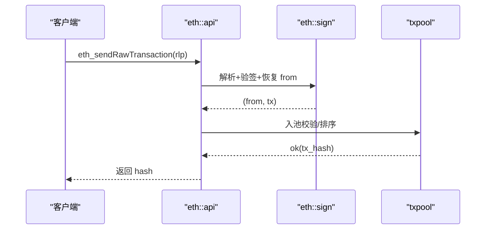

概述：管理本地账户、生成与校验签名、恢复 signer，服务交易提交与 API 调用；与费用/硬分叉规则共同决定交易有效性。

快速链接：
- 源码（sign.rs）：ref/foundry-575bf62c/crates/anvil/src/eth/sign.rs
- 源码（api.rs）：ref/foundry-575bf62c/crates/anvil/src/eth/api.rs
- 源码（fees.rs/miner.rs）：ref/foundry-575bf62c/crates/anvil/src/eth/fees.rs，ref/foundry-575bf62c/crates/anvil/src/eth/miner.rs

职责分解：
- 账户：助记词/私钥导入、预注资、解锁/锁定、冒充（impersonate）。
- 签名：EIP-155 链 ID 保护、EIP-2718/2930/1559/7702 变体解析与恢复。
- 校验：nonce/链 ID/签名曲线与 s 值范围（低 s）检查。

提交流程（简化）：

常见陷阱：
- chain_id 不一致导致验签失败；确保 CLI/Config 与交易构造一致。
- EIP-7702 授权：需正确处理授权范围与撤销；与非授权交易排序交互。
- 低 s 与 v 值：保持兼容性，但建议按 EIP-2/155 使用规范范围以减少歧义。

测试建议：
- 构造多种交易类型（1559/2930/7702）签名并发送，断言 from 恢复一致、nonce 递增与池中排序正确。
