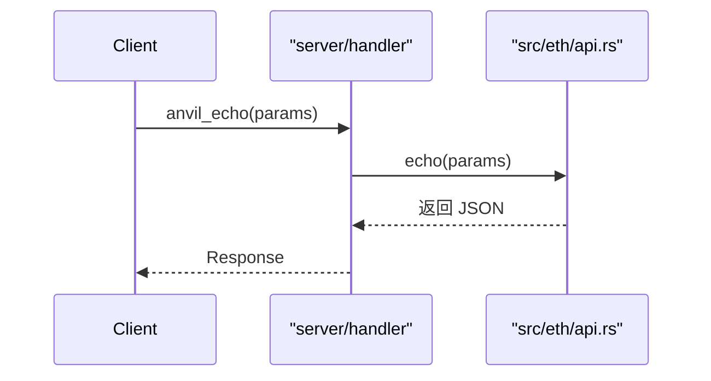

目标：在 `src/eth/api.rs` 增加 `anvil_echo`，并在 handler 注册路由，使其可被客户端调用。

关键步骤：
- 类型：复用通用 JSON 值，或定义轻量结构体；
- 路由：在 `server/handler` 中添加方法名→实现的映射；
- 实现：在 `src/eth/api.rs` 内部追加异步方法，返回输入并可选附加耗时；
- 测试：`crates/anvil/tests/it/api.rs` 或新增文件编写集成测试。

Mermaid（时序）：

延伸阅读：

- [开发指北 · 新增 RPC](../dev-guide/how-to-add-rpc)
- [架构 · RPC 类型](../architecture/rpc-types)
- [架构 · 传输层与请求入口](../architecture/transport)
