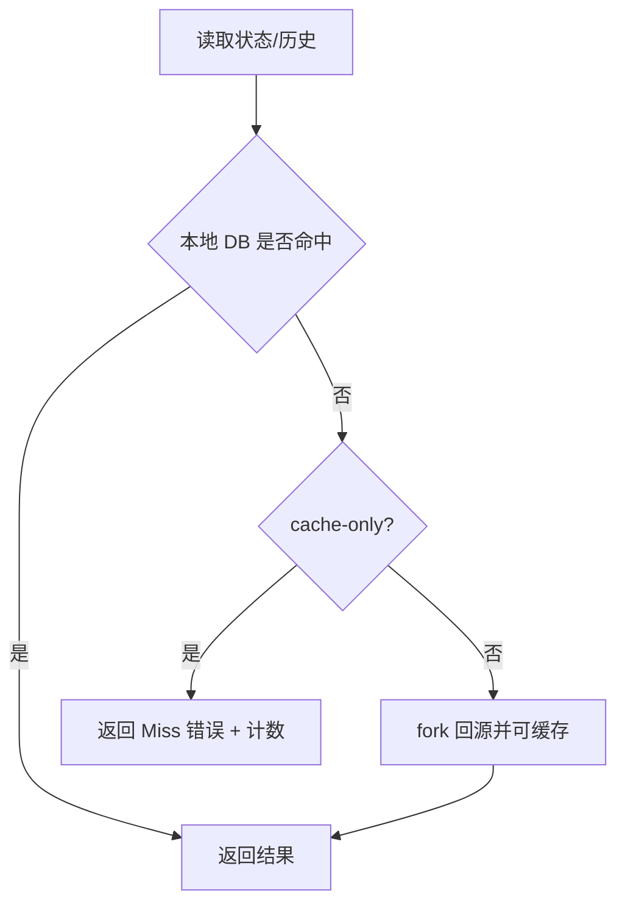

目标：在 fork 模式下增加 `cache-only` 开关，本地 DB 未命中时直接报错并计数；关闭时允许回源并可缓存。

实施：
- 配置：在 `config`/`env` 中新增布尔开关，可运行期读取；
- 读路径：`backend/db.rs` 或相邻层在 miss 分支依据开关决定行为；
- 观测：统计 Miss 次数与命中率，记录关键日志。

Mermaid（决策）：

延伸阅读：

- [分叉与快照](../fork/fork-and-snapshot)
- [EVM Backend / Executor / DB 概览](../evm/backend)
