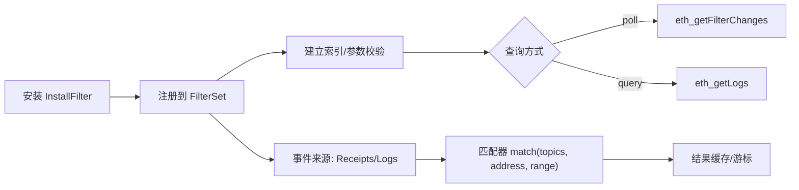
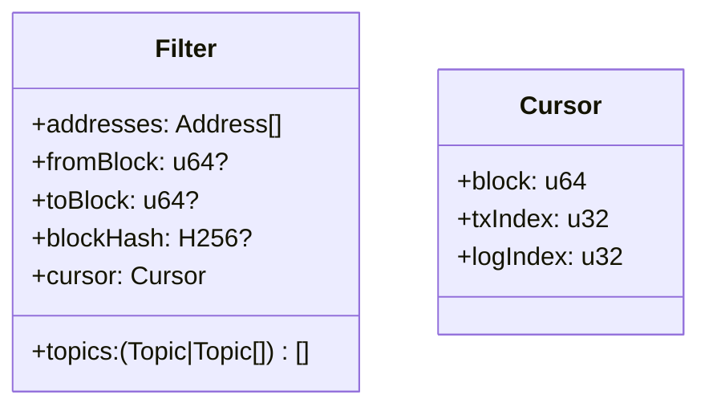

概述：本页梳理 `src/filter.rs` 的过滤器模型、生命周期与与 PubSub/日志的交互关系，并提供测试与实现跳转。

快速链接：
- 源码（filter）：https://github.com/foundry-rs/foundry/blob/575bf62c/crates/anvil/src/filter.rs
- 源码（pubsub）：https://github.com/foundry-rs/foundry/blob/575bf62c/crates/anvil/src/pubsub.rs
- 相关：`eth/backend/executor.rs` 日志产生
- 测试：`crates/anvil/tests/it/{logs.rs,pubsub.rs}`

## 模型与生命周期

- 过滤器参数：地址集合、主题（topic0..3，每位可多取 OR，位置之间 AND）、区块范围（from/to 或 blockHash）。
- 生命周期：创建 -> 匹配与累计 -> 查询/轮询 -> 超时/卸载；与订阅（pubsub）共享匹配逻辑但返回路径不同。

## 数据结构（概念）

- Filter：保存条件与游标位置；可选 TTL 以便自动回收。
- LogIndex/Store：按区块/交易/主题/地址建立倒排或快速索引以加速查询。
- Cursor：为 getFilterChanges 维护增量游标，避免重复返回。

## 与 PubSub 的关系

- 相同的匹配器复用在订阅路径（`eth_subscribe logs`）与轮询路径（`eth_newFilter`）。
- PubSub 经由 `pubsub.rs` 将匹配到的日志推送给客户端；Filter 以拉取形式提供。

## 边界与语义

- blockHash 与 from/to 互斥：按规范不可同时设置；实现需返回参数错误。
- topics 的 OR/AND：同一位数组内为 OR，各位之间 AND；支持 null 代表通配。
- 大范围查询：对 from/to 距离设置上限或分页；否则耗时与内存消耗显著。
- Reorg：对已返回的日志若发生回滚，需在订阅端发出 removed=true 的更正；轮询端下一次查询应以新链为准。

## 性能要点

- 预过滤：先按地址集做粗过滤，再按 topics 精过滤。
- 索引：按 block->tx->log 顺序存储；可选建立 topic->(block,tx,log) 倒排索引。
- 游标：为每个 filter 维护增量位置，避免 O(N) 重扫；定期清理过期 filter。

## 调试建议

- 构造多主题组合（OR/AND）与地址集合，验证匹配结果是否符合预期。
- 人为触发 reorg（回滚一个块）观察订阅端 removed 标志与轮询端结果变化。
