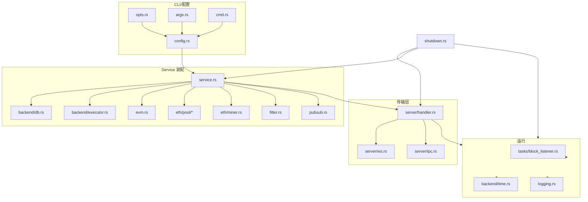

概述：本节梳理 anvil 顶层生命周期与服务装配路径。

快速链接：
- 源码（service）：https://github.com/foundry-rs/foundry/blob/575bf62c/crates/anvil/src/service.rs
- 源码（shutdown）：https://github.com/foundry-rs/foundry/blob/575bf62c/crates/anvil/src/shutdown.rs

## 启动流程（概览）

1) 解析参数/环境
	 - 入口（CLI）：`crates/anvil/bin/main.rs`
	 - 参数解析：`src/opts.rs`、`src/args.rs`、`src/cmd.rs`
	 - 生成运行配置：`src/config.rs`
	 - 参考章节：配置系统与 CLI（见 `../config/config`、`../config/cli`）

2) 初始化日志与时间源
	 - 日志：`src/logging.rs`（日志级别/格式初始化）
	 - 时间：`src/eth/backend/time.rs`（固定/可控时钟，影响出块与任务调度）

3) 装配 Service（核心组装）
	 - 构建后台组件：DB/Executor/EVM/TxPool/Miner/Filters/PubSub
	 - 代码路径：`src/service.rs`（集中装配、依赖注入、资源持有与 drop 顺序）

4) 启动传输与 RPC 入口
	 - 传输层：`server/src/handler.rs`、`server/src/ws.rs`、`server/src/ipc.rs` 与 `src/server/mod.rs`、`src/server/handler.rs`
	 - RPC 类型：`rpc/src/*`（请求/响应模型与错误）
	 - 参考章节：传输层与请求入口、RPC 类型（见 `../architecture/transport`、`../architecture/rpc-types`）

5) 启动后台任务与通知流
	 - 区块监听：`src/tasks/block_listener.rs`
	 - 事件/订阅：`src/pubsub.rs`
	 - 过滤器：`src/filter.rs`

6) 进入事件循环，等待停止信号
	 - graceful shutdown：`src/shutdown.rs` 监听信号并协调退出

## 停止与优雅关闭（graceful shutdown）

- 信号处理：捕获 SIGINT/SIGTERM 等，触发统一的关闭路径（`src/shutdown.rs`）
- 关闭顺序建议：
	1. 停止对外监听（WS/IPC），拒绝新请求
	2. 停止 Miner 定时器/出块循环、停止后台任务
	3. 刷新并关闭通知流（PubSub）
	4. 等待任务 `join`，确保 DB/Executor 等资源安全释放
- 常见坑：
	- 未阻塞等待任务退出导致资源提前 drop
	- 任务间 channel 关闭顺序不当引发 panic（注意 `select`/`broadcast` 的关闭路径）

## 关键模块与职责

- 入口与参数：`bin/main.rs`、`src/opts.rs`、`src/args.rs`、`src/cmd.rs`（解析、子命令、默认值）
- 配置：`src/config.rs`（运行期配置体、默认策略、与 CLI 的映射）
- 服务装配：`src/service.rs`（核心依赖装配、生命周期拥有者）
- 传输与路由：`server/src/*`、`src/server/*`（连接、编解码、方法路由）
- 执行与状态：`src/eth/backend/*`、`src/evm.rs`（执行器、DB、时间、fork）
- 任务与事件：`src/tasks/*`、`src/pubsub.rs`、`src/filter.rs`（后台循环、事件分发、过滤）
- 日志与错误：`src/logging.rs`、`rpc/src/error.rs`、`server/src/error.rs`、`src/eth/error.rs`
- 关闭：`src/shutdown.rs`（信号、关闭协调）

## 边界与注意事项（选摘）

- 出块节拍与时间源：固定时间 vs. 实时钟表，对交易打包/区块时间戳的影响
- 端口/IPC 冲突：传输层启动前校验绑定失败的回退策略
- 任务竞争与背压：区块监听/日志过滤的大量事件风暴下的背压与丢弃策略
- 资源释放顺序：Executor/DB 在通知流与任务完全退出后再 drop

## 生命周期（Mermaid）

后续补充：
- 增补“装配图”到各子系统页面（EVM、TxPool、Transport）
- 典型启动配置示例与期望日志输出（含失败场景）
- 与 FAQ 对接的“常见关闭/重启问题”小节
