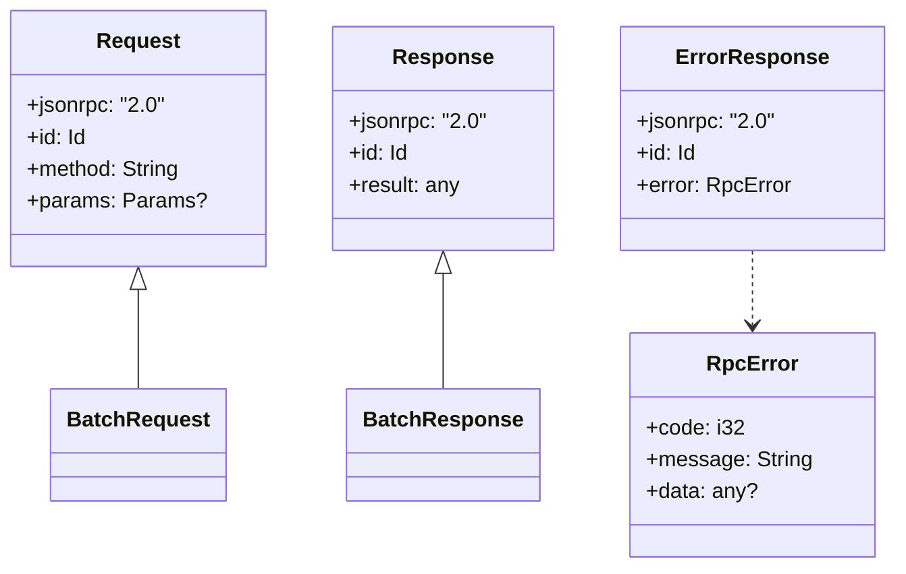

概述：`rpc/src/{lib.rs, request.rs, response.rs, error.rs}` 描述 JSON-RPC 的请求/响应模型与错误语义，并被传输层与以太坊 API 消费。

快速链接：
- 源码（request）：https://github.com/foundry-rs/foundry/blob/575bf62c/crates/anvil/rpc/src/request.rs
- 源码（response）：https://github.com/foundry-rs/foundry/blob/575bf62c/crates/anvil/rpc/src/response.rs

## 模块结构

- request.rs：定义 Request/Id/Params 等结构，支持单请求与批处理。
- response.rs：定义 Response/Result/BatchResponse 等结构。
- error.rs：JSON-RPC 标准错误与自定义扩展（错误码/信息）。
- lib.rs：对外导出与公共类型组合。



## 示例（单请求）

请求：
```json
{
	"jsonrpc": "2.0",
	"id": 1,
	"method": "eth_chainId",
	"params": []
}
```

响应：
```json
{
	"jsonrpc": "2.0",
	"id": 1,
	"result": "0x7a69"
}
```

## 示例（批处理）

```json
[
	{"jsonrpc":"2.0","id":1,"method":"net_version","params":[]},
	{"jsonrpc":"2.0","id":2,"method":"eth_chainId","params":[]}
]
```

返回可能是按请求完成顺序的数组（非必须保序），调用方需按 id 对齐。

## 通知（无 id）

- JSON-RPC 通知不包含 id，服务端不返回响应。
- 使用场景：订阅的内部握手、非关键上报等（建议谨慎使用，避免客户端等待响应）。

## 错误与映射

- 标准错误码：-32600（无效请求）、-32601（方法不存在）、-32602（参数无效）、-32603（内部错误）。
- 传输与业务映射：`server/error.rs`、`rpc/error.rs`、`src/eth/error.rs` 共同决定最终错误体。
- 日志级别：参数错误通常为 warn，内部错误建议 error 并带上 trace id/请求摘要。

## 边界与注意事项

- 批处理体积：限制单批请求数量与总字节，避免放大 CPU/内存开销。
- 参数解码：严格类型校验并提供友好错误信息（位置/字段名）。
- 非法 id：id 必须为字符串/数字或 null；不支持对象/数组型 id。
- 顺序假设：批处理响应不保证顺序，务必根据 id 关联结果。

后续补充：
- 常见以太坊方法的参数/返回值速查表（链接到相应章节）。
- 错误码与 HTTP 状态（若有代理）之间的对应关系说明。
