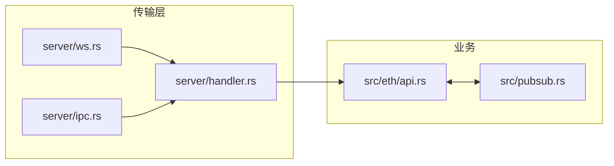
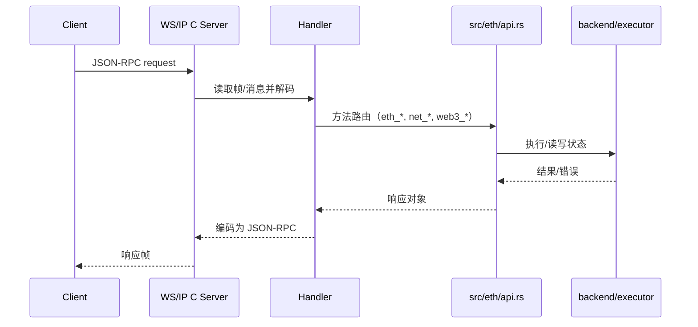

概述：对比独立 `server/` 子 crate 与 `src/server/` 内部模块，说明连接/会话、编解码与方法路由的衔接方式。

- 独立 crate：`server/src/{lib.rs, handler.rs, config.rs, ws.rs, ipc.rs, pubsub.rs, error.rs}`
- 内部模块：`src/server/{mod.rs, handler.rs, error.rs}`
- 关系：传输适配、路由入口、与 API 层的衔接

快速链接：
- 源码（server/handler）：https://github.com/foundry-rs/foundry/blob/575bf62c/crates/anvil/server/src/handler.rs
- 源码（src/server/handler）：https://github.com/foundry-rs/foundry/blob/575bf62c/crates/anvil/src/server/handler.rs

## 传输形态与职责

- WebSocket：`server/src/ws.rs` 建立长连接、管理会话、处理订阅推送（PubSub）。
- IPC（本地套接字）：`server/src/ipc.rs` 提供本地进程高带宽/低延迟通信。
- Handler：`server/src/handler.rs` 与 `src/server/handler.rs` 负责编解码、方法路由与错误映射。
- PubSub 桥接：`server/src/pubsub.rs` 作为传输侧订阅适配，与业务侧 `src/pubsub.rs` 协作。

## 请求生命周期（WS/IPC）

订阅（如 `eth_subscribe`）由 Handler 建立会话上下文并登记到传输侧订阅表，业务侧通过 `src/pubsub.rs` 推送事件；连接断开时需正确清理订阅与会话资源。

## 配置要点（选摘）

- 监听地址与端口：WS/IPC 的启用与绑定冲突处理（占用/权限）。
- 连接与消息限制：最大连接数、最大消息大小、批量请求开关与上限。
- 跨域/来源策略：WS 起源校验与安全性考量（若支持）。
- 错误映射：`server/error.rs` 与 `rpc/error.rs` 的对应关系与日志级别。

## 边界与注意事项

- 订阅清理：断连后确保注销订阅，避免内存泄漏与无效推送。
- 背压与大消息：批量调用/大 payload 的处理策略（分片/限流/拒绝）。
- IPC 权限：套接字路径的创建/权限设定；异常退出后的残留清理。
- 统一编码：严格遵循 JSON-RPC 2.0 批处理/错误协议，避免客户端兼容性问题。

## 测试与排错

- 端到端：`crates/anvil/tests/it/{wsapi.rs, api.rs}` 可作为请求/订阅的可运行样例。
- 日志排查：关注 `src/logging.rs` 的连接生命周期与错误日志；必要时调高日志级别。

后续补充：
- 增补 WS 心跳/健康检查策略与参数（如 ping/pong、超时）。
- 给出典型配置组合示例与期望行为（仅 WS、仅 IPC、同时启用）。
