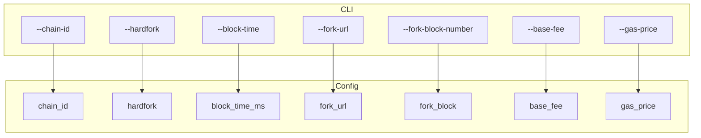

概述：命令行参数解析生成运行配置，控制出块、时间、EIP/硬分叉、fork 源、账户与网络端口等行为。

快速链接：
- 源码（opts.rs）：ref/foundry-575bf62c/crates/anvil/src/opts.rs
- 源码（args.rs）：ref/foundry-575bf62c/crates/anvil/src/args.rs
- 源码（cmd.rs）：ref/foundry-575bf62c/crates/anvil/src/cmd.rs

常用参数要点：
- 链与分叉：`--chain-id`、`--hardfork`、`--fork-url`、`--fork-block-number`
- 出块与时间：`--block-time`、`--no-mining`、`--timestamp`、`--steps-tracing`
- 费用：`--base-fee`、`--gas-price`、`--priority-fee`
- 账户：`--accounts`、`--mnemonic`、`--seed`、`--balance`、`--unlocked`
- 网络：`--host`、`--port`（HTTP）、`--ws`/`--ws-port`、`--ipc`
- 安全与限制：`--allow-origin`、`--max-request-body-size`、`--no-cors`

参数到配置映射（示意）：

建议与陷阱：
- fork 相关请固定高度以稳定测试；配合 `anvil_setNextBlockTimestamp` 控时间。
- `--block-time 0` 等同即时出块，适合快速反馈但可能改变交易顺序。
- 费用参数若同时设置，明确测试断言预期的优先级（baseFee vs gasPrice）。

示例（最小）：
- 固定分叉高度与出块间隔：
  - `anvil --fork-url <RPC> --fork-block-number 19000000 --block-time 1`
- 禁用自动挖矿、手动推进：
  - `anvil --no-mining`，测试中调用 `evm_mine`/`anvil_setNextBlockTimestamp`。
