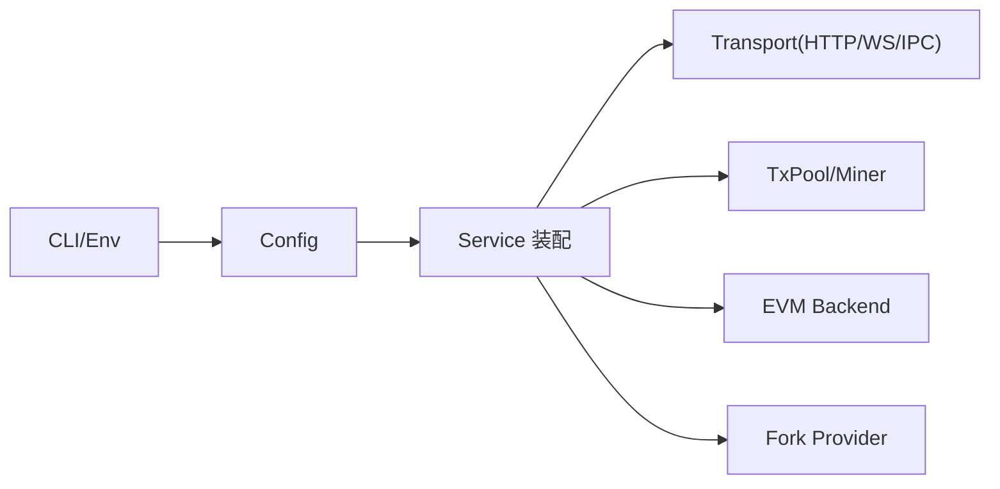

概述：`src/config.rs` 定义运行期配置与默认策略，贯穿节点装配、EVM 环境构建、挖矿/时间行为、分叉、账户与持久化等核心路径，最终在 `service.rs` 被消费。

快速链接：
- 源码（config.rs）：https://github.com/foundry-rs/foundry/blob/575bf62c/crates/anvil/src/config.rs
- 源码（service.rs 装配）：ref/foundry-575bf62c/crates/anvil/src/service.rs
- 源码（opts/args/cmd）：ref/foundry-575bf62c/crates/anvil/src/opts.rs，ref/foundry-575bf62c/crates/anvil/src/args.rs，ref/foundry-575bf62c/crates/anvil/src/cmd.rs

装配关系：

关键字段要点：
- 链与硬分叉
  - chain_id：影响签名保护（EIP-155）。
  - hardfork：决定 EVM 规则集；影响 baseFee、blobgas、warm/cold 等行为。
- 出块/时间
  - mining："auto"/"interval"/"instant"/"none"；与 "block_time_ms" 配合。
  - timestamp 策略：手动推进 vs 系统时钟；影响测试稳定性。
- 费用市场
  - base_fee、gas_price、priority_fee：默认费率与 1559/4844 路径开关。
- 分叉（Fork）
  - fork_url/fork_block：远程链数据源及固定高度；开启后缺失状态回源加载。
  - fork_headers：是否透传远端头部以影响 baseFee 等。
  - state_overrides：本地覆盖远端账户/存储/代码，便于可控测试。
- 账户
  - 助记词、数量、起始索引、预注资、解锁；是否允许冒充（impersonate）。
- 持久化与数据目录
  - 内存/磁盘/快照；影响 `evm_snapshot/evm_revert` 与重启后的可重现性。
- 服务端口与安全
  - http/ws/ipc 监听、主机名、CORS、max body、订阅限流等。
- 日志与可观测性
  - 级别、格式（plain/json）、tracing 开关、慢调用阈值等。

常见陷阱：
- 未钉死 fork_block 时远端链推进导致测试漂移；建议固定高度。
- mining="instant" 在高并发下可能改变交易相对顺序；需结合 TxPool 排序策略。
- 同时设置 base_fee 与 gas_price 时需明确优先级，避免费用断言漂移。
- persistence="memory" 重启后快照丢失；CI 中建议用 snapshot/revert。

验证建议：
- 启动时打印 Config（debug 级别），对照 CLI/默认值核验；写 1-2 个 smoke 覆盖挖矿/时间与 fork 行为。
