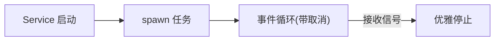

目标：实现一个长期运行的后台任务（如指标采集、重试队列），随服务启动/停止而创建/释放。

快速链接（源码）：
- 任务入口：ref/foundry-575bf62c/crates/anvil/src/tasks/mod.rs
- 区块监听：ref/foundry-575bf62c/crates/anvil/src/tasks/block_listener.rs
- 广播/订阅：ref/foundry-575bf62c/crates/anvil/src/pubsub.rs

生命周期（示意）：

建议实现要点：
- 取消与停止：使用可取消句柄（如 tokio::select + shutdown 通知）。
- 背压：对外发送（pubsub/通道）前做队列长度检查与速率限制。
- 错误恢复：可重试错误指数退避；不可重试错误记录并跳过。
- 指标/日志：关键路径 debug 日志与失败/重试计数。

最小步骤：
1. 在 `tasks::mod.rs` 注册新任务 spawn，保存 JoinHandle。
2. 任务内循环处理事件/定时器，监听停止信号。
3. 退出前释放资源，向上返回结果或记录状态。
