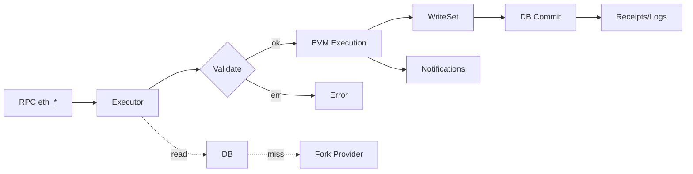

`src/eth/backend/{fork.rs, executor.rs, db.rs, env.rs, validate.rs, genesis.rs, time.rs, notifications.rs, cheats.rs}`

快速链接：
- 源码（executor）：https://github.com/foundry-rs/foundry/blob/575bf62c/crates/anvil/src/eth/backend/executor.rs
- 源码（db）：https://github.com/foundry-rs/foundry/blob/575bf62c/crates/anvil/src/eth/backend/db.rs
- 执行：`executor.rs`
- 状态：`db.rs` + `env.rs`
- 校验：`validate.rs`
- 初始化：`genesis.rs`
- 时间/通知：`time.rs`、`notifications.rs`
- 分叉：`fork.rs`（与 fork 章节联动）

## 模块结构

- executor.rs：交易执行入口；封装预校验、EVM 调用、状态提交、日志/收据生成。
- db.rs：链内状态与历史对象（账户、存储、区块、收据等）的读写接口。
- env.rs：EVM 执行环境（链配置、硬分叉、gas 规则、BaseFee、Coinbase 等）。
- validate.rs：交易与区块级别的校验（签名、nonce、余额、gas 上限、EIP 规则）。
- genesis.rs：创世状态装载。
- time.rs：时间/块号推进工具，支持手动与自动挖矿模式。
- notifications.rs：内部事件分发，供订阅/WS 通知使用。
- fork.rs：远端状态/历史代理（启用分叉时），按需回源读取并可缓存。
- cheats.rs：测试辅助能力（如设置余额、时间跳转等）。

## 执行路径（简述）

1) 预校验：签名/链 ID、nonce、余额>=gasLimit*gasPrice、EIP-1559 参数组合有效性。
2) 构造环境：根据当前头信息、硬分叉规则、base fee、coinbase、block gas limit。
3) 调用 EVM：执行交易/调用，产生日志、触发合约创建/代码执行、sstore 等写集。
4) 提交：若成功且在挖矿模式下进入区块打包；否则按调用返回；总是产生收据（call 除外）。
5) 事件：记录日志、向订阅通道投递（见 pubsub）。

## 状态与数据

- Account：balance、nonce、code、storage（trie 或本地映射）。
- Block：header、ommers、txs、receipts、状态根（本地实现可能不计算真正 Merkle 根）。
- Receipts：gasUsed、logs、status、cumulativeGasUsed。
- 索引：按区块/交易/主题建立便捷检索（服务 eth_getLogs、getTransactionReceipt 等）。

## 硬分叉与环境选择

- 依据链配置在 env.rs 内确定 EVMConfig（如 Berlin/London/Shanghai/Cancun）。
- 关键差异：gas 计价（SSTORE、CALLDATA）、BASEFEE（EIP-1559）、交易类型（2930/1559/4844）。
- time.rs 配合 autoMine/interval 决定出块节奏，影响 timestamp/baseFee 迭代。

## Fork 模式

- 读取策略：优先本地 DB；若缺失则经 fork.rs 回源（远端 RPC）并可缓存。
- 写入策略：写集仅落本地，不回写远端；同一个地址/槽位“本地覆盖”远端快照。
- 边界：远端链的动态变化可能与本地分叉点不一致，需固定分叉高度与缓存策略。

## 注意事项与坑

- 非法 nonce 或 gas 参数：在 validate.rs 拦截并返回标准化错误。
- 状态提交的原子性：一次执行产生的写集要么全部 commit，要么全部丢弃。
- 估算（eth_estimateGas）与真实执行不完全等价：环境差异（nonce、balance、baseFee、call depth）需对齐。
- 日志/收据一致性：确保失败时不写入收据（或写入失败状态，视实现而定）。
- 性能：批量读取状态时优先使用 DB 接口聚合读取，避免 N+1 回源。

## 调试与测试建议

- 最小复现：构造包含签名/nonce/gas 的最小 tx，分别走 call 与 sendRawTransaction。
- 断点：executor 入口、env 构造、预校验分支、EVM 返回值到写集转换处。
- 指标：单笔执行时延、DB 读放大、回源命中率、提交耗时；对批处理/压力场景采样。
