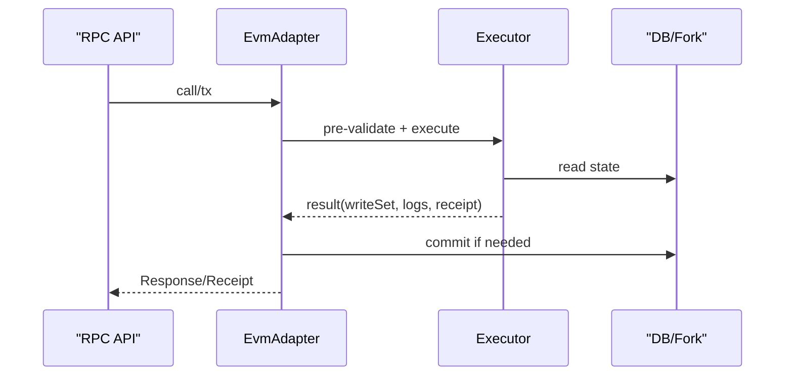

概述：`src/evm.rs` 承上启下，桥接 API 与 Backend，负责交易执行、状态访问与硬分叉条件的衔接（`src/hardfork.rs`）。

快速链接：
- https://github.com/foundry-rs/foundry/blob/575bf62c/crates/anvil/src/evm.rs

## 职责边界

- API 层到 Backend 的门面：屏蔽细节（校验、执行、提交），对外提供简洁调用接口。
- 环境拼装：根据当前链/分叉/挖矿模式构建 EVM 环境；与 `env.rs` 紧密协作。
- 错误归一：从底层错误（解码/执行/DB）到统一的 RPC 错误。
- 可测试性：便于注入 mock DB/时间/随机数等组件。

## 常用路径

- eth_call：只执行不提交；需设置 pending/call-specific env，避免污染状态。
- eth_sendRawTransaction：完整校验、执行、进入交易池/打包并提交收据。
- 估算：eth_estimateGas 重放 call 路径但调整 gas 上限和失败策略。

## 注意事项

- 与 txpool 的关系：sendRawTransaction 可能先入池再被矿工线程拾取；适配层需处理立即返回 tx hash 的时序。
- 可重入/重试：失败的执行不可重复提交写集；估算失败要区分“执行回滚 vs 输入非法”。
- 跨分叉差异：适配层在构建 env 时必须遵守当前硬分叉的 gas/规则。
