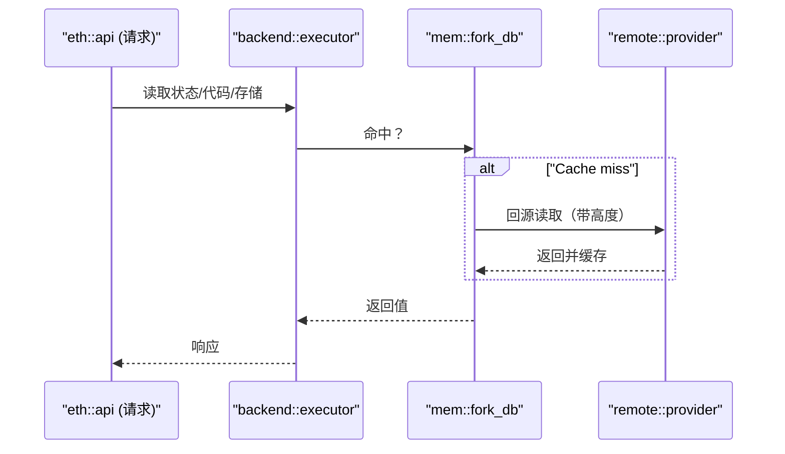
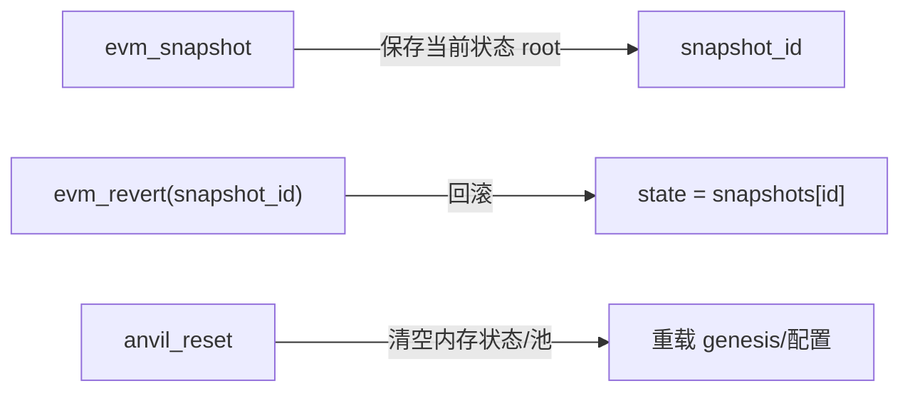

主题：
- 分叉：`src/eth/backend/fork.rs` 的远程状态访问、pre-fork 读取与本地缓存（`mem/fork_db.rs`）。
- 快照/重置：`src/eth/api.rs` 中 `anvil_reset`、`evm_snapshot`、`evm_revert` 路径。

快速链接：
- 源码（fork.rs）：ref/foundry-575bf62c/crates/anvil/src/eth/backend/fork.rs
- 源码（fork_db.rs）：ref/foundry-575bf62c/crates/anvil/src/eth/backend/mem/fork_db.rs
- 源码（api.rs）：ref/foundry-575bf62c/crates/anvil/src/eth/api.rs

分叉读路（简化）：

快照与回滚：

要点与陷阱：
- 固定 `fork_block` 避免远端高度推进导致测试漂移。
- 缓存一致性：本地修改后的账户与远端回源需以本地优先；注意覆盖规则。
- 快照数量/内存占用：长测建议定期 `reset` 或清理过旧快照。
- 回滚对 TxPool：`revert` 后应清理已执行/无效交易，防止 nonce 冲突。

验证建议：
- 用两步事务创建与还原状态，断言 storage/code/nonce 还原；再结合一次回源读验证缓存命中路径。
