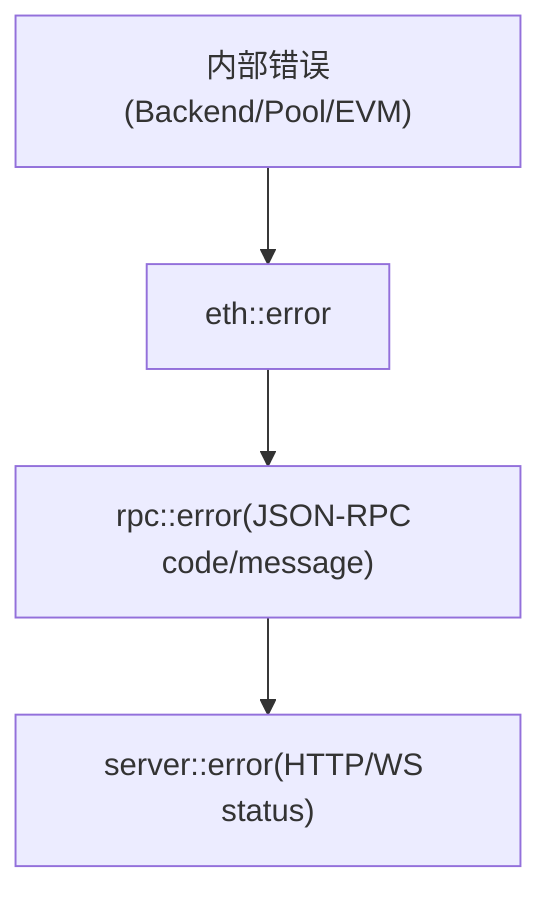

概述：统一梳理各层错误映射与日志策略，提供排错定位建议。

快速链接：
- 源码（server/error.rs）：ref/foundry-575bf62c/crates/anvil/src/server/error.rs
- 源码（rpc/error.rs）：ref/foundry-575bf62c/crates/anvil/rpc/src/error.rs
- 源码（eth/error.rs）：ref/foundry-575bf62c/crates/anvil/src/eth/error.rs
- 源码（logging.rs）：ref/foundry-575bf62c/crates/anvil/src/logging.rs

错误分层与映射：

建议实践：
- 明确可重试与不可重试错误（网络/上游暂时不可用 vs 参数非法）。
- JSON-RPC 错误：选择标准 code（-32602 参数、-32603 内部错误），附加 data 提示上下文。
- 日志分级：
  - error：不可恢复/导致请求失败；
  - warn：潜在问题（上游抖动、缓存缺失高比例）；
  - info：关键生命周期事件（启动、分叉连接、出块）；
  - debug：路径判定、开关值、计时点；
  - trace：超细节（建议仅在本地或定位时启用）。
- 结构化日志：优先 JSON 格式并附带 request_id、method、latency、peer 等字段，便于检索。

常见错误场景：
- Fork 上游 429/超时：降级为 cache-only 或回退到固定高度，必要时短暂熔断。
- 交易入池失败：nonce 过旧/不足、费用不达标、签名/链 ID 不匹配；将诊断信息写入 data。
- 出块失败：EVM 执行异常（revert/out of gas）；区分“交易回执含失败”与“区块产出失败”。

调试建议：
- 以请求为单位打印一次“起止”debug 日志，包含 method/params/hash/耗时。
- 对缓存 miss 记录一次 warn 并采样比例，衡量回源压力。
- 对长尾（>P99）RPC 方法开启慢调用阈值上报。
