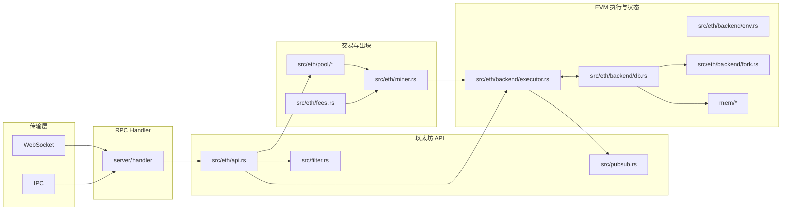

本章给出 Anvil 的功能概览与整体架构图（节点生命周期、传输层、RPC API、EVM/状态、交易池、分叉/快照）。

快速链接：
- 源码（service）：https://github.com/foundry-rs/foundry/blob/575bf62c/crates/anvil/src/service.rs
- 源码（eth/api）：https://github.com/foundry-rs/foundry/blob/575bf62c/crates/anvil/src/eth/api.rs

快速验证：见 示例 → curl: eth_chainId。

后续章节将逐一映射到真实源码目录：
- 配置与启动：`src/{config.rs, opts.rs, args.rs, cmd.rs, service.rs, shutdown.rs, logging.rs}`
- 架构（生命周期/传输/RPC 类型）：
	- 传输/请求入口：`server/src/*` 与 `src/server/*`
	- RPC 类型：`rpc/src/*`
- EVM 与状态：`src/evm.rs` 与 `src/eth/backend/*`
- 交易池：`src/eth/pool/*`
- 分叉与快照：`src/eth/backend/fork.rs` + `src/eth/api.rs`
- 发布-订阅：`src/pubsub.rs` + `src/eth/backend/notifications.rs`
- 账户与签名：`src/eth/sign.rs`
- 后台任务：`src/tasks/*`
- 可观测性：`src/logging.rs`、`rpc/src/error.rs`、`server/src/error.rs`、`src/eth/error.rs`
- 开发指南：新增 RPC/后端扩展/后台任务等操作路径
- FAQ 与排错：常见边界与排错清单
