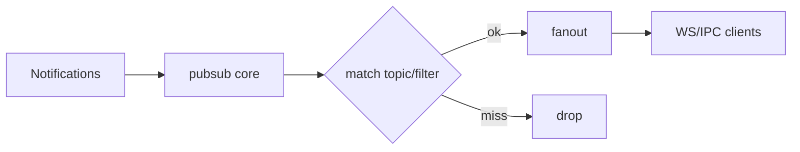
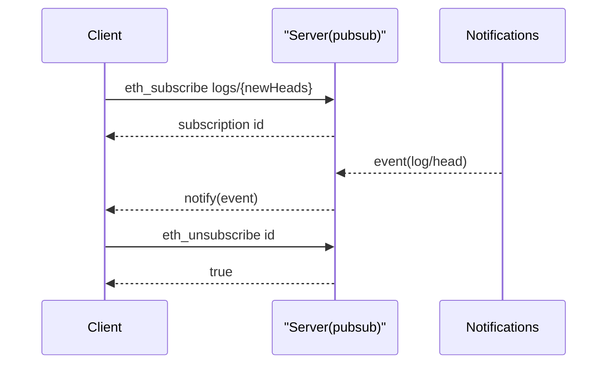

- 概述：解释发布-订阅主题、日志过滤与事件广播的协作关系。
- 传输：`server/src/pubsub.rs`
- 业务：`src/pubsub.rs`（含日志 `filter_logs`）
- 通知源：`src/eth/backend/notifications.rs`

快速链接：
- 源码（pubsub）: https://github.com/foundry-rs/foundry/blob/575bf62c/crates/anvil/src/pubsub.rs
- 源码（server/pubsub）: https://github.com/foundry-rs/foundry/blob/575bf62c/crates/anvil/server/src/pubsub.rs

## 职责与通道

- 订阅管理：创建/删除订阅，维护订阅 ID -> 过滤条件/通道 的映射。
- 事件源：区块头、交易收据日志、链重组、pending 交易等。
- 分发机制：内部使用 mpsc 广播或订阅树结构，按过滤条件路由。

## 日志订阅与过滤

- 与 filter 共享匹配器（地址/主题/范围），订阅端以推送形式接收。
- reorg 语义：对已推送的日志，在回滚时发送 removed=true 的补偿消息。
- backpressure：当客户端处理变慢时，需丢弃或限速，避免阻塞全局分发。

## 序列图（订阅生命周期）

## 边界与注意事项

- 资源限制：限制每连接的订阅数量与队列长度；空闲订阅自动过期。
- 去重：确保同一事件不被重复分发；以区块高度/tx hash/log index 去重。
- 安全：仅允许已知主题类型；参数必须严格校验。

## 测试与排障

- 编写最小订阅脚本，订阅 newHeads 与 logs，发送一笔会产生日志的交易，验证顺序与 removed 语义。
- 模拟客户端卡顿，观察 backpressure 策略是否生效且不影响其他客户端。
