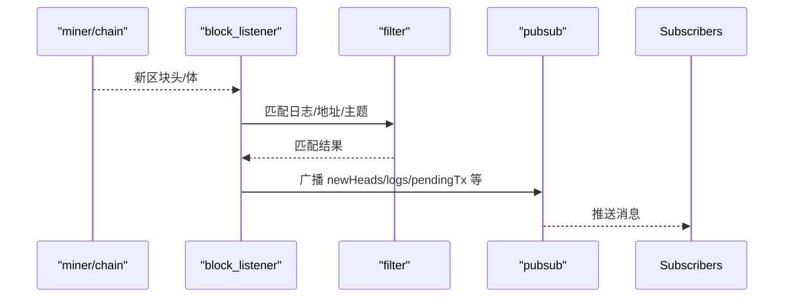

概述：监听新块（本地或上游），触发日志匹配、事件广播与过滤器增量计算等后续流程。

快速链接：
- 源码（block_listener.rs）：ref/foundry-575bf62c/crates/anvil/src/tasks/block_listener.rs
- 源码（tasks/mod.rs）：ref/foundry-575bf62c/crates/anvil/src/tasks/mod.rs
- 源码（pubsub.rs）：ref/foundry-575bf62c/crates/anvil/src/pubsub.rs

时序（简化）：

关键点：
- 订阅类型：`newHeads`、`logs`、`newPendingTransactions` 等；与 `eth_newFilter`/`eth_getFilterChanges` 协同。
- 回填与重放：当重组或回滚发生时，需要撤回与重放事件；保持订阅端一致性。
- 背压与限流：高频出块/大量日志时对单链接施加速率限制，避免 WS 堵塞。

测试建议：
- 构造匹配/不匹配的日志，断言 `getFilterChanges` 与 `eth_subscribe logs` 返回一致。
- 模拟短重组（reorg 1-2 个块），验证撤回/重放顺序与去重策略。
