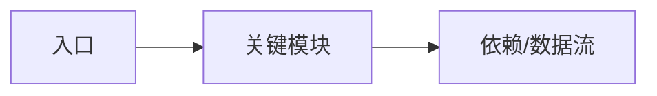

> 将本页复制为新章节起点，替换 Frontmatter 与内容。

## 章节目标（读者收获）
- 要点 1
- 要点 2
- 要点 3

## 源码定位与依赖
- 相关路径：`crates/anvil/...`
- 依赖与关系：

## 一图胜千言
- 放关键数据流/时序图（配方法名/文件路径）。
- Mermaid 注意：节点/参与者标签若包含括号、斜杠、逗号或冒号，请用双引号包裹，例如 ["DB/Fork"]、participant API as "src/eth/api.rs"；否则会触发解析错误。

## 逐步走读
- 入口 → 关键函数/类型 → 数据结构 → 边界条件（空值/大输入/权限/超时/并发）。

## 可运行示例（Try it）
- 简短步骤与期望输出；示例代码放 `docs/anvil/examples/`。

## 常见误区与排错
- 3–6 条问题清单 + 对应排查路径（文件、日志关键字、测试用例）。

## 兼容性与差异
- 与上一版本/当前 master 的差异点与迁移提醒。

## 参考与延伸
- 相关测试用例、PR、EIP 链接。
