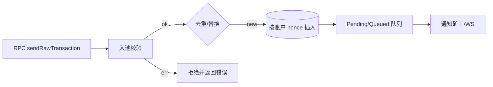

概述：`src/eth/pool/mod.rs`、`src/eth/pool/transactions.rs` 管理交易生命周期、优先级与队列（pending/queued），并受 `src/eth/miner.rs`、`src/eth/fees.rs` 影响。

快速链接：
- 源码（pool/mod.rs）：https://github.com/foundry-rs/foundry/blob/575bf62c/crates/anvil/src/eth/pool/mod.rs
- 源码（miner.rs）：https://github.com/foundry-rs/foundry/blob/575bf62c/crates/anvil/src/eth/miner.rs

## 延伸阅读

- 入池管线与校验（admission pipeline）：[pipeline](./pipeline)
- Pending/Queued 与提升机制：[pending-and-promotion](./pending-and-promotion)
- 容量限制与逐出策略：[limits-and-eviction](./limits-and-eviction)
- 规则速查：[rules-cheatsheet](./rules-cheatsheet)
- 出块与矿工：[miner](./miner)
- 费用与硬分叉：[fees-hardfork](./fees-hardfork)

## 结构

- pool：核心容器与 API，负责插入、去重、替换、逐出，以及与矿工/WS 的事件对接。
- transactions：按账户管理有序 nonce 链；分 pending（连续）与 queued（存在缺口）。
- 与 fees/miner：排序比较依赖费用规则；矿工从 pending 读取候选。

## 排序与优先级

- 账户内：nonce 严格递增；若缺口则后续交易进入 queued，待前序补齐后提升为 pending。
- 账户间：按 effective tip 排序（EIP-1559：min(maxFee-baseFee, maxPriorityFee)；Legacy：gasPrice）。
- 容量控制：池总容量/单账户上限；逐出策略倾向低费率或过旧交易。
- 替换规则：同 nonce 的新交易需满足 tip 提升阈值（如 10%-12.5%）才允许替换。

## 与链状态的联动

- 区块提交后：移除已上链交易；推进账户 nonce；触发依赖交易从 queued -> pending。
- Reorg：将受影响交易放回池中并重排；确保去重并更新有效性（余额/nonce 可能变化）。

## 注意事项

- DoS 防护：限制 JSON 与交易大小；快速失败的签名/解码；限制过深的 queued 链长度。
- 估算与入池差异：estimateGas 成功不代表入池必然成功，需再验余额/费用上限。
- 时间相关：在自动出块模式，interval 过短会降低打包效率；过长则积压交易。

## 调试建议

- 构造同账户多笔不同 nonce 的交易，观察 queued->pending 的提升过程。
- 压力测试 gasPrice 梯度，验证逐出与替换策略是否符合预期。
