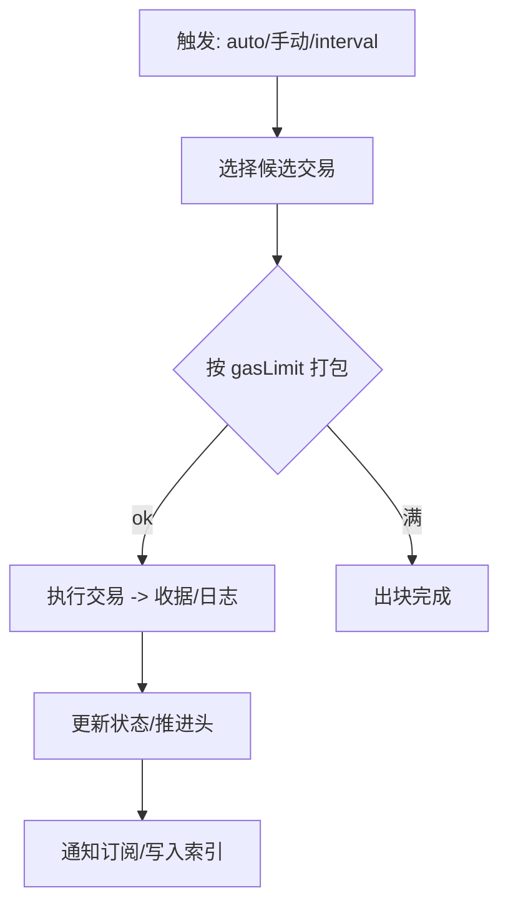

概述：本页说明 `src/eth/miner.rs` 的职责、出块节拍（自动/手动）、与交易池/执行器的协作关系。

快速链接：
- 源码（miner）：https://github.com/foundry-rs/foundry/blob/575bf62c/crates/anvil/src/eth/miner.rs
- 源码（pool）：https://github.com/foundry-rs/foundry/blob/575bf62c/crates/anvil/src/eth/pool/mod.rs
- 相关：`src/eth/backend/executor.rs`
- 测试：`crates/anvil/tests/it/transaction.rs`、`crates/anvil/tests/it/txpool.rs`、`crates/anvil/tests/it/logs.rs`

## 出块流程

## 候选与打包规则

- 候选来源：txpool 的 pending 队列，按 effective tip 从高到低选取。
- 区块限制：block gas limit、交易字节大小、log 数量等硬性约束。
- 失败处理：执行失败的交易通常丢弃或标记失败（不影响后续同账户 nonce 逻辑需谨慎）。
- 时间与 baseFee：London 后 baseFee 随区块动态；矿工需基于上一区块调整。

## 节拍模式

- 自动出块：收到交易即尝试出块或按最小间隔合并；适合开发调试快速反馈。
- 定时出块：固定间隔 tick，适合批量处理与可预测性测试。
- 手动出块：通过方法显式触发，便于断点与可重复实验。

## 注意事项

- 与 txpool 的回流：出块后需准确移除已打包交易，避免重复。
- 与 fork 的交互：fork 模式下从远端继承规则，但仅本地写入；请固定分叉点防止漂移。
- 日志与事件：确保订阅事件顺序与区块内顺序一致。
