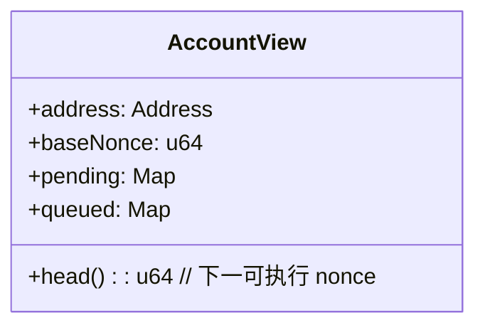
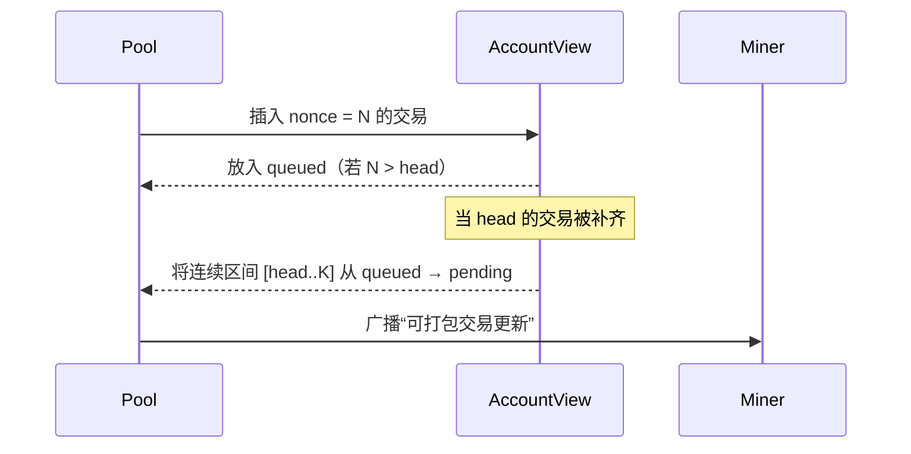

交易池将同一账户的交易组织为“可执行的连续链（Pending）”与“存在缺口的候选（Queued）”。当缺口被补齐时，后续交易会被提升至 Pending 并进入矿工的候选集合。

快速链接：
- 源码（pool/transactions.rs）：https://github.com/foundry-rs/foundry/blob/575bf62c/crates/anvil/src/eth/pool/transactions.rs
- 源码（pool/mod.rs）：https://github.com/foundry-rs/foundry/blob/575bf62c/crates/anvil/src/eth/pool/mod.rs

## 账户视图（示意）

## 提升（Promotion）

规则：
- head 由链上 nonce 与池内 pending 共同决定。
- 只要 `head` 的交易存在并成功进入 pending，随后的连续 nonce 交易将被整体提升。
- 若上链后账户 nonce 前进，pending 中小于新 nonce 的交易会被移除；随后再触发一次提升检查。

## 边界与一致性

- 同账户同 nonce 只保留一个“有效版本”，替换成功后需更新两侧视图。
- 提升不应打破 pending 的连续性；若发现缺口需回退至 queued 等待补齐。
- Reorg 与余额变化可能导致“原本可执行”的交易暂不可执行，矿工打包阶段需再次校验费用与上限。

## 建议测试

- 发送 nonce 间隔为 0、2、1、3 的序列，观察 1 到达后 2 被提升的过程。
- 触发区块提交与回滚，验证 pending/queued 的状态转换与事件。
