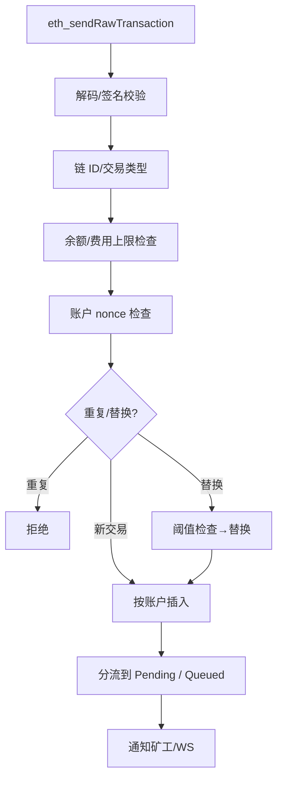

本页详解交易从 RPC 到进入交易池的各步校验与处理路径，并给出替换/去重规则与事件流。

快速链接：
- 源码（pool/mod.rs）：https://github.com/foundry-rs/foundry/blob/575bf62c/crates/anvil/src/eth/pool/mod.rs
- 源码（pool/transactions.rs）：https://github.com/foundry-rs/foundry/blob/575bf62c/crates/anvil/src/eth/pool/transactions.rs
- 相关（fees.rs）：https://github.com/foundry-rs/foundry/blob/575bf62c/crates/anvil/src/eth/fees.rs
- 相关（validate.rs）：https://github.com/foundry-rs/foundry/blob/575bf62c/crates/anvil/src/eth/backend/validate.rs

## 入池流程（概览）

步骤说明：
- 解码/签名：RLP 解码，恢复 signer；不合法直接拒绝。
- 链 ID 与类型：校验 EIP-155/2930/1559/4844 等对应字段与约束组合。
- 余额与上限：balance ≥ maxCost，避免明显无法执行的交易进入池。
- Nonce：记录账户当前链上/本地视图的 nonce，用于定位与分流。
- 去重与替换：
  - 完全重复（哈希相同）直接拒绝。
  - 同一账户同一 nonce 的“替换”需满足 tip 提升阈值，常见策略为相对提升一定比例（例如 10%–12.5%）。
- 插入与分流：
  - 如果该交易 nonce 与账户“可执行连续链”的下一位相邻，则进入 Pending；
  - 否则进入 Queued，等待缺口补齐。
- 事件：入池成功后，向矿工组件与订阅通道广播“新交易”事件。

## 费用与有效出价（EIP-1559/Legacy）

- Legacy：effectivePrice = gasPrice。
- 1559：effectiveTip = min(maxFeePerGas - baseFee, maxPriorityFeePerGas)。
- 排序使用 effectiveTip；当 baseFee 提升时，部分 1559 交易可能不再具备可执行性，应在打包/出块阶段二次过滤。

## 替换（Replace-by-fee）

- 目标：防止微小调价频繁抖动，同时允许用户用更高出价替换同 nonce 交易。
- 条件：
  - 相同账户、相同 nonce；
  - 新交易必须在签名、链 ID、基本字段上合法；
  - 新交易有效出价需超过旧交易一定阈值（比例或绝对增量）。
- 结果：旧交易被替换，并触发相应事件（可选）。

## 错误与返回

- 常见拒绝原因：签名错误、链 ID 不匹配、余额不足、字段缺失/非法、费用低于阈值、替换不达标等。
- 规范化错误：通过 `rpc/src/error.rs` 与 `server/src/error.rs` 进行映射，确保 JSON-RPC 语义统一。

## 测试

- 入池校验/替换：`crates/anvil/tests/it/txpool.rs`
- 费用/边界：`crates/anvil/tests/it/gas.rs`
