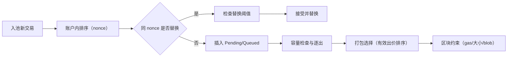

排序与打包（概要）：
- 价格优先：`maxFeePerGas` 与 `maxPriorityFeePerGas` 的综合；同价按入池时间。
- Nonce 连续：按账户内 nonce 依次可执行，缺口交易等待。
- 限制与驱逐：池上限、每账户上限、过期驱逐策略。

紧密相关源码：
- 费用/规则：ref/foundry-575bf62c/crates/anvil/src/eth/fees.rs
- 打包/出块：ref/foundry-575bf62c/crates/anvil/src/eth/miner.rs
- 校验：ref/foundry-575bf62c/crates/anvil/src/eth/backend/validate.rs
- 硬分叉：ref/foundry-575bf62c/crates/anvil/src/hardfork.rs

## 规则明细

- 账户内连续性（Pending/Queued）：
	- 同一账户的交易必须按 nonce 严格递增执行；
	- 可执行的连续前缀进入 Pending；存在缺口的后续进入 Queued，待补齐后整体提升。

- 跨账户排序（价格优先）：
	- Legacy：effectivePrice = gasPrice；
	- 1559：effectiveTip = min(maxFeePerGas - baseFee, maxPriorityFeePerGas)；
	- 打包时优先挑选更高的有效出价；同价按入池时间或稳定排序。

- 替换（Replace-by-fee，RBF）：
	- 目标：允许用户以更高报价替换同 nonce 旧交易，同时避免微小抖动；
	- 条件：相同账户且相同 nonce；新交易在签名/字段均合法，并满足“有效出价高于旧交易的阈值”（相对比例或绝对增量）；
	- 不变量：替换后仅保留一个版本；不得破坏账户 Pending 连续性。

- 容量限制与逐出：
	- 全局容量与每账户上限同时生效；
	- 逐出优先低有效出价、过旧或长链且无望执行的候选；
	- 保持 Pending 连续性，不得逐出 Pending 中的“前缀”导致不可打包。

- 打包与区块约束：
	- block gas limit、交易大小、log 数量等硬性限制；
	- London 之后 baseFee 动态，影响 1559 交易的有效出价；
	- Cancun（4844）引入 blob gas/数量上限，需与执行 gas 分开评估。

- 估算与入池差异：
	- estimateGas 为局部可行性评估，并不等价入池/打包可行；
	- 入池与打包阶段会再次依据环境（baseFee、nonce、余额）校验。

注：标签中含有字符已加引号，避免 Mermaid 解析问题。

## 实战（操作建议）

- RBF 演示（同 nonce 提价替换）：
	1) 发送一笔 nonce=K 的交易，设置较低 gasPrice/1559 tip；
	2) 以相同 nonce、较高报价重发，超过替换阈值；
	3) 观察池内旧交易被替换，新交易进入 Pending 并被优先打包。
		- 参考示例：[cast: RBF 替换](../examples/cast-rbf-replace)。

- Queued→Pending 提升：
	1) 先发送 nonce=1、3 的两笔交易（同账户），观察 nonce=3 落入 Queued；
	2) 再发送 nonce=2，观察 2、3 被整体提升至 Pending；
	3) 出块后验证顺序与账户 nonce 推进。

- 1559 排序验证：
	1) 构造不同 `maxFeePerGas`/`maxPriorityFeePerGas` 的两笔 1559 交易；
	2) 计算各自 effectiveTip，与打包顺序对齐；
	3) 调整 baseFee（通过出块节奏）观察阈值变化的影响。

更多可运行示例见“示例”章节：
- `docs/anvil/examples/curl-blockNumber.md`
- `docs/anvil/examples/curl-gasPrice.md`
- `docs/anvil/examples/cast-send-1559.md`
- `docs/anvil/examples/cast-deploy-and-call.md`

## 扩展与实现要点

- 替换阈值与比较器：在 `src/eth/pool/mod.rs` 的同 nonce 判定路径中实现阈值策略，并在排序比较器中明确“有效出价→入池时间”的稳定顺序；
- 容量与驱逐：在插入/事件路径加入容量检查与逐出策略，确保不破坏 Pending 前缀与一致性；
- 与矿工协作：入池/替换/提升后通知矿工组件，使打包器感知最新候选集合；
- DoS 防护：限制交易大小、快速失败（签名/解码/非法字段）、限制长 queued 链深度；
- 兼容性：分叉切换时同步更新环境（env/fees），避免估算与入池产生系统性偏差。

## 延伸阅读

- 入池管线与校验：`docs/anvil/txpool/pipeline.md`
- Pending/Queued 与提升机制：`docs/anvil/txpool/pending-and-promotion.md`
- 容量限制与逐出策略：`docs/anvil/txpool/limits-and-eviction.md`
- 出块与矿工：`docs/anvil/txpool/miner.md`
- 费用与硬分叉：`docs/anvil/txpool/fees-hardfork.md`
