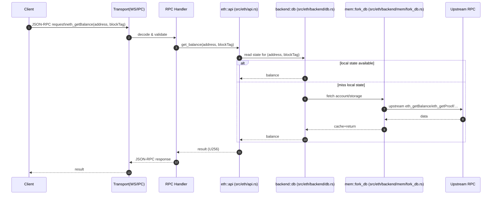
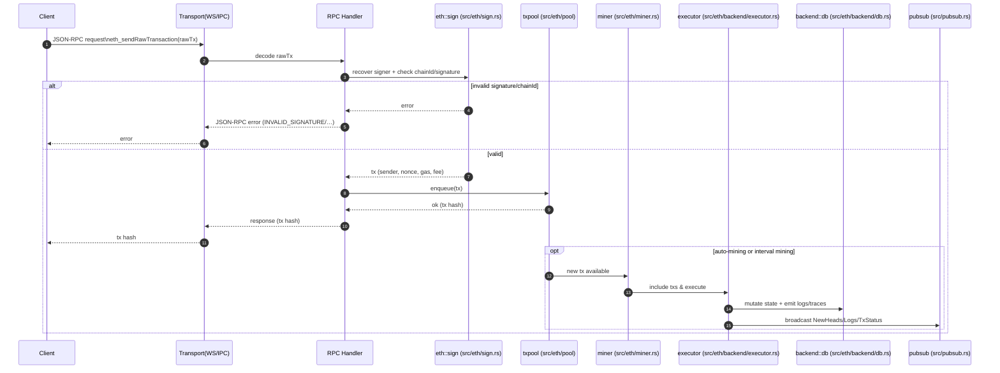
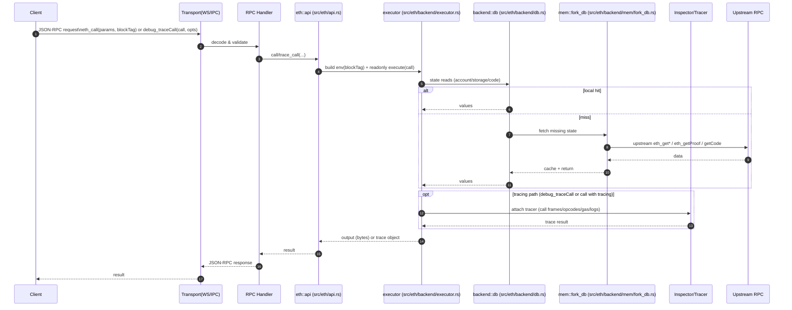

# Anvil 架构总览

本文档面向需要理解与扩展 Anvil 的开发者，概述模块分层、启动流程、关键数据流与扩展点，并给出源码对照路径与测试定位方法。

- 读者对象：熟悉 Rust/以太坊基本概念的贡献者
- 目标：在 30–60 分钟内建立“请求如何到达执行后端、状态如何被维护、事件如何被分发”的清晰心智模型

---

## 目录

- [顶层分层与职责](#顶层分层与职责)
- [启动与生命周期](#启动与生命周期)
- [关键目录速览（本 crate）](#关键目录速览本-crate)
- [三条关键数据流](#三条关键数据流)
- [时序图：典型调用链](#时序图典型调用链)
  - [1) eth_getBalance](#1-eth_getbalance)
  - [2) eth_sendRawTransaction](#2-eth_sendrawtransaction)
  - [3) eth_call / debug_traceCall](#3-eth_call--debug_tracecall)
- [调试断点建议（实用）](#调试断点建议实用)
- [参考路径清单（便于快速定位）](#参考路径清单便于快速定位)

---

## 顶层分层与职责

Anvil 在 crates/anvil 下按“可执行入口 + 业务编排 + 传输 + RPC 类型 + 核心类型”分层：

- 可执行入口
  - `bin/main.rs`：程序入口，解析 CLI，启动服务与优雅退出。
- 顶层编排（本 crate）
  - `src/`：将配置、传输层、RPC handler 与以太坊语义、EVM 后端串联起来。
- 传输层（子 crate）
  - `server/`：WebSocket、IPC、PubSub、连接与会话管理。
- RPC 类型与错误（子 crate）
  - `rpc/`：JSON-RPC 请求/响应模型、错误语义、序列化规则。
- 核心类型（子 crate）
  - `core/`：对外/对内共享的以太坊基础类型与 serde 辅助。

> 提示：顶层 anvil crate 负责“把一切拼起来”，`rpc/` 与 `core/` 更偏协议与数据模型，`server/` 管“怎么通信”。

---

## 启动与生命周期

启动主链路（文件路径在括号内）：

1) 入口与参数解析（`bin/main.rs` → `src/opts.rs`/`args.rs`/`cmd.rs`）
   - 使用 CLI 解析（clap 风格）生成运行配置或子命令。
2) 服务构建与启动（`src/service.rs`）
   - 基于 `src/config.rs` 产出的配置，初始化日志（`src/logging.rs`）、EVM 后端、传输监听（WS/IPC）、RPC handler、任务调度器等。
3) 运行期（`src/server/*`, `server/` 子 crate, `src/eth/*`）
   - 处理 RPC 请求、维护内存状态与（可选）远程 fork 缓存、打包/出块、分发事件。
4) 优雅关闭（`src/shutdown.rs`）
   - 监听信号，停止接受新连接，结束后台任务，释放资源。

---

## 关键目录速览（本 crate）

- 配置与启动
  - `src/config.rs`：运行配置结构与默认策略
  - `src/opts.rs`/`args.rs`/`cmd.rs`：CLI 参数与子命令
  - `src/service.rs`：服务装配与启动/停止
  - `src/logging.rs`：日志初始化
- 以太坊 API 与业务
  - `src/eth/api.rs`：JSON-RPC 方法实现（eth_* 等）
  - `src/eth/error.rs`：以太坊层错误
  - `src/eth/fees.rs`：费用与 EIP-1559 等规则
  - `src/eth/miner.rs`：打包/出块策略与节拍
  - `src/eth/sign.rs`：交易签名/校验/账户
  - `src/eth/util.rs`：工具函数
  - `src/eth/backend/`：执行后端（执行器、DB、环境、fork、创世、时间、校验）
    - `mem/`：内存状态实现、缓存、inspector、state/storage
- 交易池与过滤
  - `src/eth/pool/*`：交易池/队列与策略
  - `src/filter.rs`：过滤器（logs/blocks/txs）与查询
- 传输与 handler
  - `src/server/{mod.rs, handler.rs, error.rs}`：顶层与子 crate `server/` 的整合
  - `src/pubsub.rs`：订阅/广播整合
- 其他
  - `src/evm.rs`：EVM 相关桥接
  - `src/hardfork.rs`：硬分叉切换与规则
  - `src/tasks/*`：后台任务（出块监听等）
  - `src/otterscan/*`：与 Otterscan 相关的 API

子 crates：
- `server/`：`{config.rs, ws.rs, ipc.rs, pubsub.rs, handler.rs, error.rs}`
- `rpc/`：`{lib.rs, request.rs, response.rs, error.rs}`
- `core/`：`{lib.rs, types.rs, eth/*}`（block、wallet、subscription、serde_helpers 等）

---

## 三条关键数据流

1) RPC 请求流
- 传输层接收（WS/IPC）→ `server/handler` 解析 JSON-RPC → 路由到 `src/eth/api.rs` 方法 →
  调用 `eth/backend/executor.rs` 查询/执行（读写 `mem` 状态，必要时通过 `fork_db` 远程读取并缓存）→
  聚合结果为 `rpc/response.rs` → 通过传输层返回或经 `pubsub` 分发。

2) 交易提交流（`eth_sendRawTransaction`/`eth_sendTransaction`）
- 解析与签名校验（`eth/sign.rs`）→ nonce/费用/链规则校验（`fees.rs`/`hardfork.rs`/`backend/validate.rs`）→
  入池（`eth/pool/*`）→ 出块周期或手动触发打包（`eth/miner.rs`）→ 状态变更与日志生成（`backend/executor.rs`）→
  事件/订阅通知（`pubsub.rs`）。

3) Forking 状态访问
- 本地缺失状态时，`mem/fork_db.rs` 通过远端（上游节点）拉取账户/存储/区块数据，写入本地缓存 →
  与本地内存状态叠加，读优先本地覆盖，确保执行一致性与性能。

---

## 配置系统（`src/config.rs` + CLI）

- 来源：CLI 参数（`opts.rs`/`args.rs`/`cmd.rs`）、默认值、可能的环境变量或配置文件（若启用）。
- 作用：
  - 监听地址/端口、传输协议（WS/IPC）、是否开启 HTTP（若支持）、CORS/Host 校验
  - 出块策略（自动间隔/手动）、时间操控、gas/费用策略、链 ID、硬分叉区块
  - 账户预置/解锁、助记词/私钥导入、初始余额、base fee 等
  - Fork 源（远端 RPC URL、高度、Cache 策略）

---

## 传输层与 PubSub（`server/` 子 crate + `src/server/*`）

- WS/IPC 监听：建立连接、会话管理、消息编解码、心跳/关闭。
- JSON-RPC handler：请求解析/批量/错误返回；将方法路由到 `eth::api`。
- PubSub：对新块、日志、交易池事件建立订阅，按主题广播到活跃连接。

---

## EVM 执行后端与状态（`src/eth/backend/*`）

- `executor.rs`：交易与调用执行，产生日志/迹线，提交状态变更。
- `env.rs`：执行环境（区块头、时间、余额、gas 限额等）。
- `db.rs`：状态访问抽象；在 `mem/` 下有内存实现与 fork 缓存实现。
- `fork.rs`：远端状态拉取与本地缓存策略。
- `genesis.rs`：创世状态与预置账户。
- `time.rs`：时间推进、warp、interval。
- `validate.rs`：交易/区块的各类校验。

> 内存实现（`mem/`）：`state.rs`、`storage.rs`、`cache.rs`、`fork_db.rs`、`inspector.rs` 等负责实际读写与观测。

---

## 交易池与出块（`src/eth/pool/*`, `src/eth/miner.rs`, `src/eth/fees.rs`）

- 交易池：
  - 接收新交易，维护基于 nonce/费用的队列与替换策略（如价格替换规则）。
  - 提供打包候选与账户级别的执行顺序控制。
- 出块：
  - 定时/手动触发生成新区块；将交易按 gas/费用与硬分叉规则打包。
  - EIP-1559 base fee/priority fee 等由 `fees.rs` 协助计算。
- 硬分叉：
  - `hardfork.rs` 决定启用的规则集（如 EIP-4844、EIP-7702 等）。

---

## 日志与过滤（`src/filter.rs`）

- 过滤器生命周期：安装 → 匹配（地址/主题/区块范围）→ 查询或订阅。
- 事件来源：执行器产生日志；新块时触发匹配与推送。
- 历史查询：基于内存状态与（可选）fork 源的回填策略。

---

## 账户、签名与 Cheatcodes（`src/eth/sign.rs`, `src/eth/backend/cheats.rs`）

- 本地账户管理：预置账户、解锁与私钥管理、助记词衍生。
- 签名校验：`eth_sendRawTransaction` 验证链 ID、签名与 nonce。
- Cheatcodes：测试/开发辅助能力（如时间/状态操控），由后端 `cheats.rs` 实现并受配置约束。

---

## 后台任务与调度（`src/tasks/*`）

- `block_listener.rs`：监听新区块（本地或上游），触发二级流程（日志推送等）。
- `mod.rs`：统一启动/停止各任务，确保与 `shutdown.rs` 配合实现优雅关闭。

---

## 错误处理与可观测性

- 错误：
  - 传输错误（`server/error.rs`）、RPC 错误（`rpc/error.rs`）、以太坊层错误（`src/eth/error.rs`）。
  - 统一映射为 JSON-RPC 错误码与可读信息。
- 可观测性：
  - `src/logging.rs` 控制日志级别与格式；建议在关键路径保留 `debug` 日志。

---

## 开发者操作指南（扩展点）

1) 新增一个 RPC 方法（例如 `eth_myMethod`）
- 在 `src/eth/api.rs` 添加方法实现（必要时在 `src/eth/macros.rs` 注册/导出）。
- 在需要的地方添加类型（`core/types.rs` 或 `rpc/{request,response}.rs`）。
- 在 `src/server/handler.rs`（或相应路由表）确保方法名正确映射。
- 添加集成测试（见下节）。

2) 扩展执行后端能力
- 在 `src/eth/backend/*` 中增加新的执行钩子或状态通道（如新增 inspector）。
- 若涉及持久化/缓存策略，更新 `mem/*` 并补充 fork 交互逻辑。

3) 增加一个后台任务
- 在 `src/tasks/` 新建任务，提供启动/停止接口，并接入 `tasks::mod` 的生命周期管理。

4) 新增配置项
- 更新 `src/config.rs`，在 `opts/args` 中暴露 CLI 参数，设置默认值与解析逻辑。
- 在 `service.rs` 消费该配置，串联到传输/后端/任务。

---

## 测试即文档（如何定位测试）

集成测试位于 `crates/anvil/tests/it/`，按主题划分：
- `api.rs`、`anvil_api.rs`、`wsapi.rs`：RPC 行为
- `transaction.rs`、`txpool.rs`：交易/池
- `traces.rs`：执行踪迹
- `logs.rs`、`pubsub.rs`：事件与订阅
- `fork.rs`、`optimism.rs`：分叉/二层
- `eip4844.rs`、`eip7702.rs`：新规则验证
- `state.rs`、`genesis.rs`、`gas.rs`：状态/创世/费用

建议阅读路径：先跑一两个测试用例，断点进入 `src/eth/api.rs` 与 `backend/executor.rs`，从请求到状态变更完整走通一次。

---

## 调用链速查（样例）

以 `eth_getBalance` 为例（简化）：
- 传输层接收 → JSON-RPC 解析为 `rpc/request.rs`
- `src/server/handler.rs` 路由到 `src/eth/api.rs::get_balance`
- `api.rs` 通过 `backend/db.rs` 查询账户余额；若本地缺失，`mem/fork_db.rs` 远端拉取并缓存
- 结果经 `rpc/response.rs` 序列化返回

以 `eth_sendRawTransaction` 为例（简化）：
- 解码与签名校验（`eth/sign.rs`）→ `eth/pool` 入队
- 出块周期（`eth/miner.rs`）触发 `backend/executor.rs` 执行 → 状态更新/日志
- `pubsub` 对订阅者广播新块/日志/交易状态

---

## 常见问题与边界

- 时间与出块：是否自动出块？出块间隔多大？是否允许时间跳跃（cheatcodes/time）？
- 费用市场：是否启用 EIP-1559？base fee 与 priority fee 的计算参数？
- Fork 行为：远端不可达时的容错与缓存失效策略？
- 内存状态：长运行时的内存占用与清理策略？
- 并发：WS/IPC 连接量与消息风暴下的背压策略？

---

## 贡献者快速开始

- 跑通构建：在仓库根目录执行 `cargo build`。
- 选择一个 API 流程（建议 `eth_getBalance` 或 `eth_sendRawTransaction`）设置断点并单步调试。
- 变更前先补测试，优先覆盖 happy path + 1 个边界条件（如 nonce 冲突或无效签名）。

---

## 参考路径清单（便于快速定位）

- 入口：`crates/anvil/bin/main.rs`
- CLI/配置：`crates/anvil/src/{opts.rs, args.rs, cmd.rs, config.rs}`
- 服务装配：`crates/anvil/src/service.rs`
- 传输整合：`crates/anvil/src/server/{mod.rs, handler.rs, error.rs}` + 子 crate `crates/anvil/server/src/*`
- RPC 模型：`crates/anvil/rpc/src/{request.rs, response.rs, error.rs}`
- 以太坊 API：`crates/anvil/src/eth/{api.rs, error.rs, fees.rs, miner.rs, sign.rs, util.rs}`
- 执行后端：`crates/anvil/src/eth/backend/{executor.rs, db.rs, env.rs, fork.rs, genesis.rs, time.rs, validate.rs}` + `mem/*`
- 交易池：`crates/anvil/src/eth/pool/*`
- 过滤/日志：`crates/anvil/src/filter.rs`
- 任务：`crates/anvil/src/tasks/*`
- 测试：`crates/anvil/tests/it/*.rs`

---

如需添加特定调用链的时序图/类图，请提具体 API 名称，我会补上对应图示与源码跳转标注。

## 时序图：典型调用链

下面给出两条常用 RPC 的时序图，帮助建立端到端的数据/控制流直觉。

### 1) eth_getBalance

要点：
- blockTag 可为 latest/safe/finalized/编号；请求被路由到 `src/eth/api.rs`。
- 本地状态缺失时走 `mem::fork_db` 回源并缓存，再统一经 `backend::db` 返回。

参考实现：
- 路由/处理：`src/server/handler.rs`、`crates/anvil/rpc/src/{request,response}.rs`
- 读取路径：`src/eth/api.rs` → `src/eth/backend/{db.rs, mem/fork_db.rs}`

### 2) eth_sendRawTransaction

要点：
- RPC 返回的 tx hash 通常在入池成功时立即返回；出块/状态提交可能异步发生（取决于挖矿模式）。
- 费用/nonce/规则校验涉及 `fees.rs`、`validate.rs`、`hardfork.rs`；失败会在入池前返回错误。

参考实现：
- 验签/恢复：`src/eth/sign.rs`
- 交易池：`src/eth/pool/{mod.rs, transactions.rs}`
- 出块/执行：`src/eth/miner.rs`、`src/eth/backend/executor.rs`
- 事件：`src/pubsub.rs`、测试见 `tests/it/{transaction.rs, txpool.rs, logs.rs, pubsub.rs}`

### 3) eth_call / debug_traceCall

要点：
- `eth_call` 为只读执行，不持久化状态；`debug_traceCall` 在只读执行基础上启用 tracer，返回详细调用/指令轨迹。
- 缺失状态与 `eth_getBalance` 类似，通过 `fork_db` 回源并缓存。

参考实现：
- API：`src/eth/api.rs`
- 执行：`src/eth/backend/executor.rs`（只读路径/外部环境构建）
- 状态：`src/eth/backend/{db.rs, mem/fork_db.rs}`
- Tracer/Inspector：`src/eth/backend/mem/inspector.rs`（及相关 tracer 集成）

---

## 调试断点建议（实用）

- 路由与方法分发：`src/server/handler.rs`（确认 method 名到 API 的映射是否正确）
- 具体 RPC 实现：`src/eth/api.rs`（eth_getBalance / eth_call / eth_sendRawTransaction 等入口）
- 验签与交易解析：`src/eth/sign.rs`（签名恢复、链 ID 校验、nonce/fee 读取）
- 交易池：`src/eth/pool/{mod.rs, transactions.rs}`（入池、替换、候选选择）
- 出块与打包：`src/eth/miner.rs`（自动/手动出块路径、区块模板）
- 执行器：`src/eth/backend/executor.rs`（状态读写、只读执行、提交与日志产生）
- Fork 回源：`src/eth/backend/mem/fork_db.rs`（缺失状态的远端读取与缓存）
- 过滤与日志推送：`src/filter.rs`、`src/pubsub.rs`（事件匹配与广播）
